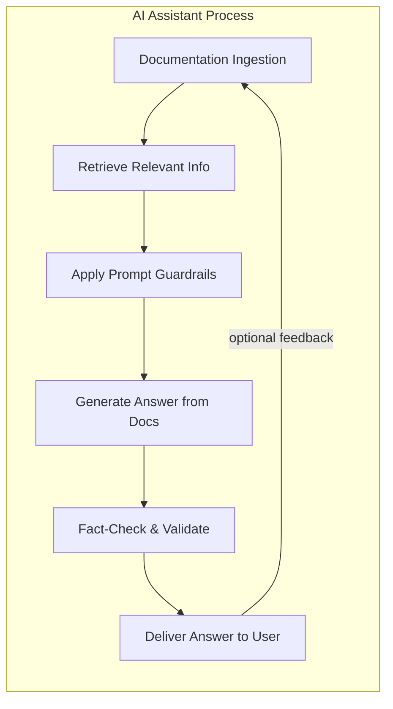

# AI-native Technical Communications Doctrine v1.0

---
title: "Introduction"
description: "Why documentation must evolve for an AI-first world."
intended-audience: \["Engineers", "Product Managers", "Technical Writers", "LLM Prompt Engineers"]
version: "1.0"
---

## Introduction

The way people consume technical documentation is undergoing a fundamental shift. Instead of reading long manuals or web pages, users increasingly ask AI assistants (like ChatGPT or Claude) to find answers for them. In fact, by 2025 over half of people expect AI to replace traditional search engines, and developers now turn to tools like ChatGPT for help more often than they open official docs. Google’s integration of AI summaries into search results (reaching billions of users) underscores this new reality. This means the **primary reader of documentation is becoming the AI system itself** – which then interprets and relays information to the human user.

Why is this shift happening? AI assistants can deliver just-in-time, specific answers without requiring a human to manually search and skim multiple documents. They excel at synthesizing information from various sources and providing a concise response. However, an AI can only be as accurate and helpful as the documentation it has access to. If documentation isn’t written and structured in a way that AI systems can easily ingest and navigate, users will get outdated or incorrect answers (or none at all). Organizations are already observing cases where their guides don’t show up in chatbot answers or the bots quote obsolete info because the docs weren’t updated for AI consumption.

**AI-first documentation** is an inevitable evolution to address this gap. In an AI-first approach, we write documentation *for the benefit of AI readers first*, and human readers second. This does **not** mean humans never see the docs or that AI replaces documentation entirely. It means documentation is prepared in a format that **optimizes AI understanding and retrieval** – clear structure, unambiguous references, explicit metadata – so that any AI (from customer support bots to ChatGPT plugins) can find and present the right information on demand. High-quality, fact-based documentation remains as critical as ever; what’s changing is *how* that documentation is consumed and mediated. As one industry expert noted, LLMs are already part of users’ workflow, making AI-aware documentation the “new baseline” for delivering information.

This doctrine lays out a blueprint for this new era. It challenges traditional, human-first documentation practices and introduces principles to design content that is *prompt-ready* and AI-friendly from the start. It is intended for engineers, product leads, and architects who need to ensure their documentation will be correctly interpreted by AI systems (and thus correctly conveyed to users). The goal is to prevent the common pitfalls of AI-doc interactions – such as hallucinated answers, context confusion, or missed information – by fundamentally rethinking how we author technical content. In the sections that follow, we contrast the “old world” vs. “new world” of documentation, debunk myths, and establish core principles of AI-native technical writing. We then dive into practical guidelines: how to embed helpful cues and metadata in docs, how to break down information into retrievable modules, and how to implement pipelines that connect documentation to LLMs (Large Language Models) with accuracy and guardrails. Real-world case studies (using open-source projects and our own products) will illustrate what this doctrine looks like in practice. Finally, we provide checklists to help teams adopt these practices and for individual writers to create AI-ready content.

The core thesis is provocative but simple: **for most complex products, the first “user” of your documentation is now an AI agent**. Embracing that reality can dramatically improve the quality and timeliness of answers your actual customers and team members get. Ignoring it, on the other hand, risks making your documentation irrelevant. The following doctrine is our guide to navigating this transition and ensuring that documentation remains a first-class asset in the age of AI.

---
title: "Old World vs. New World"
description: "Contrasts between human-first and AI-first documentation approaches, debunking common myths and highlighting practical consequences."
intended-audience: \["Engineers", "Product Managers", "Technical Writers", "LLM Prompt Engineers"]
version: "1.0"
--------------

## Old World vs. New World

In the **old world** of documentation, humans were the direct consumers. Authors wrote lengthy guides or reference manuals assuming a human would read them end-to-end or search within them. Information was often presented in a narrative format or buried in long paragraphs. The burden was on the reader to scan, find, and interpret the relevant parts. For example, a developer using PostgreSQL might have to manually dig through a 50-page tuning guide to find how to adjust a memory parameter. Documentation in this paradigm is typically optimized for visual navigation (with tables of contents, sidebars, and formatting cues that humans recognize) and for explanatory depth, assuming the reader will invest time to absorb context.

In the **new world** of AI-first documentation, the primary consumer is an LLM-driven assistant. The AI does the searching and scanning for the user. This flips many assumptions:

* **Retrieval vs Reading:** Instead of a person reading sequentially, an AI will retrieve the specific chunk of text needed to answer a question. Thus, each piece of documentation must stand on its own as a *retrievable unit* that makes sense out of context. If a crucial fact is hidden midway through a long paragraph, an LLM might miss it or mix it up with unrelated text. The new world demands granular, well-labeled chunks of information that map cleanly to likely queries.

* **Explicit vs Implicit context:** Humans can use visual layout and prior paragraphs to infer context (“the figure above”, “as mentioned earlier”). LLMs don’t interpret documents visually or remember what came before unless it’s included in the same text chunk. They process text in isolated chunks based on semantic relevance. That means any references in documentation need to be explicit. For instance, saying “restart the service to apply *it*” is ambiguous to an AI – *what* does “it” refer to? (the config change or the file?) In AI-first docs, we would write “restart the server to apply the new configuration” so there’s no guesswork. Vague pronouns and implicit references are a relic of the old world that don’t translate well to AI readers.

* **Structured for Algorithms:** In human-first docs, a dense page with multiple topics might be readable via skimming and headings. But an AI may treat an entire section as one data chunk and can’t easily separate unrelated points if they’re lumped together. In AI-first docs, structure isn’t just for visual appeal – it’s a machine-readable map. Every heading, list, and formatting choice can affect how the AI chunks and ranks information. For example, if a Kubernetes guide combines deployment configuration and networking policy on one page, an AI might retrieve that whole page for a question about networking, bringing in extraneous info. The new approach would likely split those into distinct sections or pages, so queries about networking only retrieve networking content.

These differences lead to a pivotal realization: **the way we’ve traditionally written and organized docs often does not align with how AI systems process text**. Long paragraphs that cover multiple concepts, inconsistent hierarchy of headings, or relying on visuals (screenshots, diagrams) to convey key information – all these can “confuse” an LLM. Common pitfalls in old-world docs include:

* *Unstructured text:* If everything is in one big blob or a flat document with few headings, the AI’s vector search might grab irrelevant surrounding text. As Mintlify’s research notes, *“flat text with poor hierarchy”* makes it hard for the model to separate topics.
* *Inconsistent formatting:* Mixing code examples inline with prose, or using different terms for the same concept, can break the token patterns that the AI uses to interpret content. A human might figure out that “app server”, “application server”, and “service” all refer to the same thing from context, but an AI might not realize they are the same and treat them as separate cues.

To better illustrate the contrast between the old and new paradigms, consider the following **flow of information**:


*Old World Flow – human authors produce static documentation for human readers, who must search, navigate, and read the content themselves.*

```mermaid
flowchart LR
    A[Human Authors] --> B[AI-ready Modular Docs + Prompts]
    B -->|ingestion| D[LLM Index]
    D -->|retrieval & synthesis| E[AI Assistant]
    E --> F[Human User (answers on demand)]
```

*New AI-native Flow – human authors produce AI-ready, modular documentation (with embedded guidance) that is ingested into an LLM’s index. The AI assistant retrieves relevant pieces, synthesizes an answer in context, and delivers it to the human user on demand.*

In the new world, the documentation is not a static book but a dynamic knowledge base that an AI can query. The role of the human author shifts from writing explanatory prose for direct reading to **writing precise reference material for computational use**. The AI becomes the explainer and storyteller, generating human-friendly narratives from the raw facts and instructions that we provide in the docs.

### Myths vs. Truths

As we transition from the old to the new model, it’s important to address some myths and clarify truths about AI’s impact on documentation:

**Myth:** AI will replace documentation entirely.
**Truth:** AI will replace *how* documentation is accessed, not the need for having documentation. We still need high-quality, up-to-date, fact-rich docs as the source of truth behind AI answers. An LLM can only generate text based on existing content; it’s not capable of magically creating accurate product information from a vacuum. In short, if you don’t document something, the AI won’t know it – or worse, it will try to fill the gap with a plausible-sounding guess. Far from making docs obsolete, AI’s rise makes **well-structured documentation even more critical** to avoid the misinformation that comes from AI “hallucinations.” Companies cannot rely on an LLM’s general training data for product-specific answers because *“without detailed company information, GenAI tools extrapolate information to fill knowledge gaps,” producing incorrect statements (hallucinations)*. The remedy is to feed AIs with complete and accurate documentation, not to skip documentation altogether.

**Myth:** Writing for AI is the same as writing for humans – if the content is good, the AI will figure it out.
**Truth:** Writing for AI requires a different approach: more structured, explicit, and modular. In human-oriented writing, eloquence and flow are valued; in AI-oriented writing, clarity and unambiguity are king. For example, a human reader might enjoy a tutorial that tells a story, but an AI might struggle to distill facts from that narrative. When writing for AI consumption, we must anticipate how an LLM will interpret each sentence. This means using consistent terminology (so the AI doesn’t miss that two phrases mean the same thing), breaking information into discrete sections (so it can be retrieved in isolation), and even providing guidance in the text for how it should be used. One might say it’s a more *schema-aware* style of writing – almost like writing for a compiler or database. The content should be **explicit in context, modular in format, and tagged or structured in ways that an AI can leverage**. As a simple example, including a FAQ section with a direct Q\&A format is far more “AI-friendly” than burying the answer to a common question in the middle of a paragraph; the AI can easily match a user’s question to a Q\&A pair and extract the answer. In general, **AI-first docs are written with the expectation that an algorithm (which is literal and pattern-matching) will read them**, whereas human-first docs rely on a human’s intuition and reasoning. The difference is subtle in wording but big in outcome. Writing for AI means spelling everything out (no guesswork), structuring everything (no implicit order), and labeling everything in a machine-consumable way.

**Myth:** Adding AI tooling (like a chatbot) to existing docs is enough; we don’t need to change how docs are written.
**Truth:** *Tools are not a substitute for strategy.* Simply layering an AI search on top of legacy documentation often exposes the weaknesses of those docs. If the documents are not already optimized for AI parsing – lacking clear structure or containing ambiguous language – the AI solutions built on top will falter. We’ve seen instances where organizations plug their docs into a retrieval-augmented chatbot and find that it returns wrong or mixed-up answers. The root cause is usually documentation that was written solely for human eyes. To fully realize AI’s benefits, you must **adapt the documentation itself**, not just slap on an AI interface. The doctrine’s core principles (outlined next) address how to write and organize content so that any AI tool can make sense of it. In short, **an AI assistant is only as good as the docs it has**. Investing in AI-first writing pays off by making those assistants accurate and reliable.

With these myths dispelled, the consequences become clear. The old world approach – writing docs as if a human will individually read each page – will lead to AI assistants that often *misinterpret or overlook information*. Users will lose trust if the AI provides wrong answers or says it can’t find something that is actually in the docs (just poorly organized). The new world approach, however, promises faster, context-rich answers delivered to users exactly when they need them. It enables a single source of documentation to power many assistive experiences: chatbots, voice assistants, integrated help in apps, etc., all drawing from the same AI-ready knowledge base. It also changes the role of documentation teams and technical writers: their audience expands to include AI systems, and their work becomes central to training and guiding those systems. In the next section, we delve into the core principles that make documentation AI-native, laying out how to actually write and structure docs for this new paradigm.

---

title: "Core Principles"
description: "Foundational principles for AI-native documentation: modularity, fact-based writing, prompt-ready structure, and embedded system guidance."
intended-audience: \["Engineers", "Product Managers", "Technical Writers", "LLM Prompt Engineers"]
version: "1.0"
--------------

## Core Principles

What does it mean to write documentation *for AI first*? At a high level, it means applying a set of principles that ensure the content is *machine-navigable, unambiguous, and readily usable in an AI conversation*. Here are the core principles of AI-native documentation, which form the foundation of this doctrine:

* **Modularity:** Break documentation into small, self-contained modules or sections, each focused on a single concept, feature, or task. Each module should ideally answer one primary question or serve one specific use-case. This modularity aligns with how LLMs retrieve information: they fetch the few chunks most relevant to a query. If your product documentation is one giant monolith, the AI may retrieve a large irrelevant chunk along with the relevant info, leading to diluted or confusing answers. Modular docs ensure that when a question is asked, the AI can pull just the right piece. For example, in a Redis guide, instead of a single page covering all commands, each command (GET, SET, EXPIRE, etc.) would be a module with its description and examples. A question about the “EXPIRE” command would retrieve only that module, not an entire commands reference. Think of modules as **atomic facts or instructions** – small building blocks that can be assembled to answer complex queries.

* **Clear Structure and Hierarchy:** Use a consistent, logical heading hierarchy and formatting conventions so the AI can understand relationships between topics. Each page or section should have a clear title, and sub-sections that descend one level at a time (avoiding skipping heading levels). A well-structured document is like a well-formed outline – it signals to the AI what each part is about. Consistent hierarchy also prevents unrelated info from being lumped together. If you have an H2 for “Installation” and another H2 for “Configuration”, don’t suddenly tuck a new topic under an H4 somewhere without intermediate H3s – it might get lost. Structure is not just for humans; it’s a map for AI on how content is segmented. As Kapa.ai’s team observed, *“properly structured documentation can significantly improve LLMs’ ability to understand and respond to user queries”*.

* **Fact-Based, Source-of-Truth Writing:** Emphasize factual, definitive statements and avoid fluff or ambiguous commentary. LLMs are superb at using facts provided to construct answers, but they can also be misled by speculation or marketing language in docs. Write documentation content as if you’re populating a knowledge base – each statement should be correct and verifiable. Wherever possible, **quantify and specify**. For instance, instead of “The application uses very little memory,” say “The application uses approximately 50 MB of memory when idle.” The AI will then confidently include those specifics in an answer about memory usage. Fact-based writing also means including default values, limits, versions, etc., directly in the text. Essentially, we want to minimize scenarios where the AI has to “guess” or use its general training to fill gaps – the docs should supply the facts. Ensuring accuracy in docs is the first guardrail against AI hallucination. If the docs cover most questions with factual answers, the AI has less room or need to make something up.

* **Prompt-Ready Style:** Write content in a way that it can be directly used in an AI’s response with minimal alteration. This involves a few tactics:

  * Use the user’s perspective in descriptions (“To do X, **you** should...”) judiciously, because the AI often outputs answers addressing the user as “you.” If the documentation is written from a third-person perspective (“The user should do X”), the AI might awkwardly convert that. Consider writing steps and explanations in a way that an AI could lift them as-is into a helpful reply. Many docs already do this for clarity (second-person, imperative mood), which doubles as AI-ready phrasing.
  * Anticipate likely questions and phrasing, and mirror those in the documentation. For example, a heading like “How to reset the password for a user” is both human-friendly and likely to match a user’s question. Including Q\&A formatted sections or an FAQ is a great way to have prompt-ready content. If an FAQ entry literally poses the question a user might ask, the AI can spot that and directly use the provided answer.
  * Ensure that examples and references are self-explanatory. A code block should usually be accompanied by a one-line description of what it is (“Example of a POST request to the login API”). That way, if the AI includes the example in an answer, it has the description to introduce it. Similarly, avoid references to external context (“see the figure above”) – the AI won’t include the figure, so that text becomes meaningless in the answer. Always assume the content might be excerpted on its own. Each module should contain enough context to be understood independently.

* **Consistency and Terminology:** Establish consistent terms, naming, and style across the docs. This might not sound “AI-specific”, but it is crucial for AI. LLMs use semantic patterns to retrieve text; if you refer to the same concept by different names in different places (e.g., “access token” vs “auth token” vs “token”), the AI might not link those together and could miss relevant info. Pick one term for one concept and use it uniformly. Consistency also applies to formatting – e.g., always format code as code (with backticks or code blocks) when referring to it. If sometimes you write a command in plain text and elsewhere as `code`, the AI might tokenize them differently. A consistent style acts like a schema that the AI can learn. It also reduces the chance of retrieval errors where, say, the AI doesn’t realize an acronym used in one part of the docs is the same as a spelled-out term in another. If acronyms are necessary, define them clearly and perhaps list them in a glossary section (which the AI can consult). Think of it this way: treat the documentation like code – consistency and lack of ambiguity help avoid “bugs” in the AI’s understanding.

* **Embedded Guidance and Metadata:** One novel principle of AI-native docs is including guidance *inside* the documentation that helps the AI use it correctly. This can be done through system prompts, comments, or metadata fields that are part of your docs pipeline. For example, you might include an internal note in a doc page: “> NOTE (for AI): This section is version-specific. Ensure the user has specified the version.” A human reader might ignore this or not see it if it’s hidden metadata, but an AI system could be configured to respect such notes, adjusting its answer or asking the user for their version. Another example is embedding a “role” or audience in the frontmatter metadata of a document (e.g., intended-audience: expert or beginner). An AI could use that to tailor the detail level of its answer based on who is asking. **System prompts** (the hidden instructions given to an AI before it answers) can also be informed by documentation content. Some implementations include a “instructions.md” file in the docs that contains guidelines like “When answering questions about the API, if the request is about authentication, remind the user about security best practices.” This can be ingested and always prepended as part of the AI’s context. While not all AI systems will automatically use such embedded guidance, designing your docs with this in mind is forward-looking. It ensures that as your AI assistants become more sophisticated, they have the metadata and cues needed to enforce policies (security, confidentiality) and context (e.g., which product the user is asking about) automatically. Practically, this principle encourages using frontmatter YAML in each doc with fields for things like version, product, module, sensitivity, etc., and populating them diligently. These metadata fields don’t matter to a human reader, but they are gold for an AI pipeline. They can be used to filter search results (e.g., retrieve only docs for “version: 3.x” if the user is on version 3), to format answers (e.g., mention the version), or to apply the correct tone (user documentation vs internal technical note). In essence, **write your docs as if you’re teaching an AI assistant how to do the job of a documentation expert** – because that’s what you’re doing.

To illustrate these principles, let’s imagine a simple example from an open-source project like Kubernetes. In a human-first world, you might have a single page “Networking” that explains various networking concepts (Services, Ingress, DNS, etc.) in a long form. In an AI-first approach, you would modularize this into distinct pages or sections: one for Services, one for Ingress, one for DNS configuration, etc. Each of those pages would start with a clear definition (“Ingress is a Kubernetes object that allows external access to services, typically via HTTP/HTTPS...”), list key facts (maybe bullet points of what it does and doesn’t do), and perhaps include an example YAML config with an explanation. The frontmatter might tag each page with `area: networking` and `version: ["1.26","1.27"]` if relevant. If a user asks the AI “How do I expose a service externally in Kubernetes?”, the assistant might retrieve the “Ingress” module and the “Service” module. Because those modules are focused and labeled, it will find the exact instructions and example needed, and because we wrote them in a straightforward, you-oriented way, it can almost copy-paste the steps into the answer. If something is version-specific (maybe Ingress behaves differently in older versions), our docs’ metadata or embedded notes would alert the AI to clarify the Kubernetes version, rather than giving a generic answer.

It’s worth noting that these core principles benefit *human* readers as well. Clarity, modularity, and factual accuracy are hallmarks of good documentation in general. The difference is that in an AI-first doctrine, we are uncompromising about these principles because the AI won’t “forgive” unclear writing the way a human might. A human reader might puzzle through a muddy sentence or infer meaning from context; an AI could misinterpret it entirely or ignore it. By adhering to these principles, we create documentation that is **dual-purpose**: it serves the AI in delivering quick answers, and it remains perfectly accessible to any human who reads it directly. In fact, many of these ideas align with what some call “Generative Engine Optimization (GEO)” – making content readable and useful to LLMs.

In summary, the core doctrine for AI-native writing is: *write less like you’re writing a book, and more like you’re building a knowledge database*. Every section is an API endpoint the AI can call; every sentence is a potential fact it might quote. In the next section, we build on these principles and talk about concrete techniques for architecting documentation systems and content that fully embrace the AI as a first-class consumer.

---

title: "Architecting for AI"
description: "Embedding system prompts, context cues, and usage patterns in documentation to guide AI behavior."
intended-audience: \["Engineers", "Product Managers", "Technical Writers", "LLM Prompt Engineers"]
version: "1.0"
--------------

## Architecting for AI

Applying the doctrine of AI-first documentation is not only about writing style, but also about *content architecture*. We need to design our documentation corpus in a way that integrates seamlessly with AI systems. This involves thinking about how docs are segmented, annotated, and even how they might “communicate” with the AI through prompts or metadata. Here are key strategies for architecting documentation that plays well with AI:

**1. Use Frontmatter and Metadata as a Schema:** In an AI-native doc system, every documentation page or module should begin with a metadata block (e.g., YAML frontmatter) that categorizes that content. Examples of useful metadata fields: version, product or subsystem, topic category, keywords, intended audience, last updated date, and any flags (like “experimental” or “deprecated”). This metadata is incredibly useful for an ingestion pipeline:

* It allows the search index to filter or boost results. If a query includes “PostgreSQL 14”, the system can prioritize chunks with `version: 14`.
* It lets the AI dynamically tailor responses. Knowing the intended audience (say “beginner” vs “expert”) could let an AI simplify an explanation if the user is a novice, or provide extra technical detail if the user is advanced.
* It helps maintain context. For instance, if a piece of documentation has `product: opsfolio` vs `product: surveilr`, an AI chatbot that knows the user is asking about Surveilr can ignore or de-prioritize Opsfolio docs to avoid confusion. In a human scenario, a reader might accidentally read the wrong product’s docs and get confused; an AI can be smarter by using metadata to stay in the lane.

The key is to **plan your frontmatter schema and use it consistently**. This might require adding these metadata fields retroactively to legacy docs, but it’s a one-time effort that greatly enhances machine interpretability. Some modern documentation platforms and static site generators support YAML frontmatter natively, which we can leverage. Even if your current docs system doesn’t, you can maintain metadata in an external index or as comments in the docs that the ingestion script reads.

**2. Embed AI-oriented Cues and Warnings:** Think about scenarios where an AI might need to be cautious or add context. You can embed cues for these in the docs. A classic example is a **guardrail prompt** for sensitive or dangerous operations. Suppose you have a section of Linux documentation on formatting disks. For a human, you might write a warning: “**Warning:** This command will erase the disk.” An AI might or might not include that warning when giving an answer about disk formatting, depending on if it retrieves that part of the text. To be safe, make such warnings highly visible in text (using a clear “Warning:” label as we normally would) *and* consider an AI-specific note. For instance, in the documentation text itself one could add: “*(AI note: Always remind the user to backup data before formatting.)*”. If your ingestion pipeline captures such parenthetical notes (perhaps marked in a special way), the AI assistant could be programmed to incorporate them into its response as appropriate. Some documentation teams handle this by maintaining a **system prompt file** containing general guidelines (like “Always warn about destructive actions”) so the AI’s behavior is guided globally. But embedding the reminder next to the actual instruction in the docs is a belt-and-suspenders approach – it ensures that even if the global prompt is forgotten, the retrieved doc chunk carries the caution.

Another use of embedded cues is indicating related information. For example, a documentation page about an API endpoint could have a note: “See also: Authentication (required to use this endpoint)”. A human might see that and navigate accordingly. An AI, on retrieving that chunk, could use that cue to fetch the Authentication section as well for a more complete answer. In architecture terms, we’re **linking nodes of knowledge in a way that an AI can follow**. Simple explicit hyperlinks or references in text work because the vector search might catch the anchor text. Additionally, if you know certain questions span multiple modules, you might include a brief mention of one inside the other. For instance, in a module about “Troubleshooting login issues”, include a line like “If you need to reset your password, see the Password Reset section.” A user query about login problems that also involve password might cause the AI to retrieve both sections thanks to that cross-reference.

**3. Incorporate Usage Patterns and Examples as First-class Documentation:** AI systems trained on your docs can provide not just static answers, but dynamic examples and patterns. If you include rich examples in your documentation (which you absolutely should), consider structuring them in a way that is easy for the AI to extract. For instance, if documenting a function, have a sub-section “Example” with a step-by-step example usage. If documenting a concept, include a short Q\&A in the doc itself (“Q: How do I do X? A: By ...”). These effectively pre-package a mini conversation that the AI can directly draw from. The AnythingLLM platform and others have shown that including FAQ-style content significantly boosts answer quality. It’s like pre-seeding the AI with a set of question-answer pairs.

Also, identify *usage patterns* – common ways users interact with your product – and ensure they are documented clearly. For example, a usage pattern in PostgreSQL might be “connecting to the database using SSL.” Instead of hoping the user pieces together an answer from various paragraphs, you might have a dedicated section “How to connect with SSL” that lists steps. This not only helps human readers but gives the AI a ready-made answer to a very likely question.

From an architecture perspective, this may lead you to create new sections or documentation pages that didn’t exist in the human-first docs. In human-first docs, you might not have an explicit “How do I…?” section if the information is sprinkled throughout a guide. But for AI consumption, it’s worth consolidating and making an explicit module for each significant user task or problem scenario. Essentially, **think in terms of questions and answers when deciding what modules to include**. A good practice is to gather actual user questions (from support tickets, forums, Stack Overflow, etc.) and ensure each one maps to a specific place in your documentation structure. If it doesn’t, create a doc for it (even if it overlaps with existing content). Redundancy is less harmful in AI docs than obscurity; if two questions have overlapping answers, you can have two entries and trust the AI to pick up the relevant pieces. It’s more important that the question’s phrasing exists somewhere in the docs so the AI can latch onto it.

**4. Leverage Diagrams and Mermaid (with Descriptive Text):** Visuals like architecture diagrams or flowcharts can be very helpful to human readers. LLMs can’t directly “see” an image, but if you use Mermaid diagrams (which are text-based) or include the textual description of an image, those become part of the ingestible content. For example, instead of just embedding an image of your system architecture, include a list of bullet points that describe the image (“Component A connects to B, then sends data to C…”). An AI might not present the image, but it can convey the same info using those bullets. Mermaid diagrams, being written in text, might even be parsed or at least partially understood by an LLM (they typically ignore code blocks, but a caption above it explaining the diagram could be useful). The key is: **don’t let important info live only in images or non-textual formats**. Always accompany visuals with text explanation. In AI-first docs, we sometimes write the descriptive text first (for the AI’s sake) and then include a diagram for the human. This ensures the knowledge in the diagram isn’t lost on the AI. Moreover, including diagrams as Mermaid in Markdown (like we do in this doctrine) means that even if an AI doesn’t process the diagram, a human viewing the docs on GitHub can see it rendered, so it’s a win-win for dual audiences.

**5. System Prompt Integration:** Consider maintaining a “System Guide” as part of your documentation set. This could be a document that outlines the tone, style, and safety rules for answering questions about your product. For example, it might say “Always answer with a polite, professional tone. If the question is about pricing or sales, refer them to contact sales. Do not reveal internal codenames or unannounced features.” Normally, this is something you’d configure in the AI platform rather than in docs. But by writing it down in a markdown file (even if you don’t publish it to end-users), you treat it as part of the documentation canon. Some integrated solutions ingest everything – you might choose to ingest the system guide with a tag like `role: system` so that your AI middleware knows to prepend it as a system message. The doctrine here is to **treat the AI’s configuration as documentation too**. It should be under version control, written in human language, and perhaps even reviewed by tech writers or subject matter experts. By formalizing it, you reduce the risk of a misconfigured AI (which is analogous to a doc with a big hole in it).

In practice, architecting for AI might involve re-organizing your documentation repository. You might create new folders for different content types (how-tos, reference, troubleshooting) corresponding to how you expect to index and retrieve them. You might introduce a naming convention for doc files that aligns with common queries (e.g., `how-to-reset-password.md`). The architecture should serve two masters: it should still make sense for a human browsing the repository or site, and it should be highly convenient for an AI to pinpoint relevant information.

Let’s apply these ideas briefly to an open-source example like **SQLite**. SQLite’s documentation in the old world is a mix of a long FAQ, a single long “lang\_features” page, and some scattered files. In an AI-first re-architecture, we might split the FAQ into individual Q\&A entries as separate markdown files (all under an “faq/” directory, each with frontmatter tags for topic). We’d break the language specification into modules for each concept (expressions, datatypes, functions, etc.). We’d add frontmatter indicating which SQLite version they apply to (since SQLite evolves over time). We might also add a top-level “system.md” describing SQLite’s typical usage contexts (since an AI might benefit from knowing that SQLite is embedded, file-based, etc., as a baseline). We ensure that every common user question (“How do I backup a SQLite database?”, “What is the maximum database size in SQLite?”) is answered explicitly in at least one module. The result: a user asks a chatbot “What’s the maximum size of a SQLite database?”, the bot finds the “maximum size” doc (with that phrase in the title or metadata), and returns the factual answer (e.g., \~281 TB for SQLite) along with any caveats mentioned. Without that explicit doc, the AI might try to remember or guess from training data, which could be outdated or wrong.

To conclude this section: **architecting documentation for AI** requires thinking of your documentation set as a structured data source and not just a collection of pages. It’s about organizing knowledge in a way that an AI can efficiently query it, much like designing a database schema for queries. By embedding rich context, guidance, and cross-links into the docs, we essentially “teach” the AI how to use our documentation effectively. In the following section, we zoom in on the concept of “fact modules” and patterns – essentially continuing this thread by discussing how to identify and package the facts in your product into AI-ready chunks.

---

title: "Fact Patterns and Modules"
description: "Breaking down products into retrievable fact units for accurate AI retrieval."
intended-audience: \["Engineers", "Product Managers", "Technical Writers", "LLM Prompt Engineers"]
version: "1.0"
--------------

## Fact Patterns and Modules

One of the most practical steps in making documentation AI-native is to **break your knowledge into retrievable units**, which we can call modules or fact modules. This process is both an art and a science. It’s about identifying the *fact patterns* in your product – the recurring kinds of information or questions – and ensuring each is documented in a tidy, accessible way.

Think of your product and list out the types of “facts” someone might ask about:

* Definitions of key concepts (“What is X?”).
* How-to procedures (“How do I do X?”).
* Configuration options and their meanings (“What does setting X do?”).
* Limits and constraints (“What’s the max of X? Can I do X concurrently?”).
* Error messages and troubleshooting (“What does error code 123 mean? How to fix Y error?”).
* Best practices or recommendations (“Recommended approach for X?”).

In a human-first doc, these facts might be sprinkled across pages or discussed in paragraph form. In AI-first doc, **each atomic fact or small group of related facts should ideally live in its own module or clearly delineated section.** This ensures that when an AI searches for that fact, it finds a dedicated chunk rather than a passing mention.

For example, let’s say we have an open-source database (like PostgreSQL). Fact patterns include:

* **Configuration parameters**: Each parameter (e.g., `shared_buffers`, `work_mem`) is a fact unit. Documentation should list what it does, its default, min/max, effect, etc., ideally under a heading that is exactly the parameter name. That way, if a user asks “What does `work_mem` do in PostgreSQL?”, the AI can pull the chunk under the `work_mem` heading, which has the explanation and default value.
* **SQL commands or functions**: Each command (`SELECT`, `CREATE TABLE`, etc.) or built-in function (`NOW()`, `SUM()`) is a fact unit. Traditional docs might have one giant page for all SQL functions. AI-first would argue for each function (or at least each category of function) to be separate or at least distinctly indexed. In fact, some projects have done this – e.g., the Redis documentation gives each command its own page, which is very AI-friendly.
* **Error codes**: If your system has error codes or messages (like “ORA-XXXXX” in Oracle, or specific log errors), treat each as a fact unit. Document it with a description and solution if applicable. Users often ask, “I got error X, what does it mean?” If the doc has a one-to-one mapping (error code -> doc section), the AI can directly answer that. If errors are only described in a prose paragraph (“various errors might occur when Y fails…”), the AI might not pinpoint the right part.
* **FAQ or How-to scenarios**: As mentioned earlier, frequent tasks or issues should have their own modules. E.g., “Resetting a user password”, “Upgrading from version 1 to 2”, “Configuring TLS”, etc. Each of these scenario-based guides is effectively a factual sequence (a series of steps or an explanation of a process).

Once you identify these fact patterns, the next step is to **module-ize** them in the docs:

* Use descriptive, specific headings (H1/H2 titles) that match the concept or question. If the fact is a definition, the heading should be the term itself (“What is a Replica Set?” could just be “Replica Set” as the heading, with the text explaining it).
* Keep modules concise. A module could be a few sentences to a few paragraphs, but generally not pages long. If it’s too long, consider if it contains multiple facts that should be split. The idea is that each module should ideally answer one question really well. If the answer is too complex, maybe it’s actually multiple questions.
* Ensure each module is **self-contained contextually**. If a module depends on knowledge from another, either merge them or clearly reference the other. For instance, if you have a module “Transactions in Redis” and it assumes the reader knows what a Redis command is, that’s fine because presumably the AI can fetch definitions too. But within that module, if you use a concept that has its own module, you might want to mention it (e.g., “Redis transactions use the `MULTI` and `EXEC` commands (see respective command reference).”). This way the AI might bring in those references if needed.

**Avoiding overlap and conflict:** With many small modules, one concern is ensuring they don’t contradict each other or go out of sync. This is where having a single source-of-truth fact per module helps. Instead of describing the same feature in multiple places, centralize it and have others reference it. For example, if a certain limitation (say “maximum number of connections = N”) applies system-wide, document it in one module (maybe under a “Limits” section) and have other relevant sections mention that or link to it. Redundancy in wording is not as problematic as inconsistency; the AI might retrieve one or the other, so it’s okay to repeat a fact in multiple modules *as long as it’s consistent*. However, if you update a value, update it everywhere it appears. This is just good documentation practice in general, but especially important when an AI might pull from either place and we don’t want conflicting info.

**Semantic Chunking:** The technical process behind the scenes (in RAG – retrieval augmented generation) is that the doc text is chunked into vectors. We, as documentation architects, can influence chunk boundaries by how we structure the text. If a heading and paragraph go together, that might become a chunk. If one paragraph covers two topics, that’s bad because one chunk may contain both, confusing the retrieval. By making modules as standalone sections, we essentially align our content with how we want chunks to be. An AI can sometimes retrieve part of a chunk, but typically it brings the whole chunk. Thus, we want each chunk to be “clean”. The earlier example from Mintlify illustrated that if you discuss permissions and rate limits in one paragraph under one heading, an AI might return both when only one is asked about. Fact modules solve that: one module for “Updating permissions”, another for “API rate limits”.

**Just-in-time context assembly:** When modules are well-designed, an AI can assemble them to answer multi-faceted questions. Suppose a user asks, “How do I update permissions and what are the rate limits?”. If we have separate modules, the AI can fetch both and present a combined answer. If it was one blob in the docs, the AI might fetch that one blob and give the answer – fine in this case – but if the question was just about one part, it might still fetch the blob and include unnecessary info. With separate modules, the AI has the flexibility to grab one or many as needed. In essence, each module is like a puzzle piece that the AI can use to build a response specific to the query.

**Identification exercise:** A recommended exercise in adopting this doctrine is to review your documentation (or knowledge base) and list the top 50–100 factual questions that one could ask about your product. Then map each question to where in the docs that answer lives. If some answers are not easy to point to (or require reading through paragraphs to find), that’s a candidate for creating a new module or section. This approach ensures you cover the most important ground. For example, in a project like **Linux kernel documentation**, questions might be “What is the scheduler frequency in Linux?” or “How to enable debug mode for driver X?”. If the answers are buried in long text, create an explicit Q\&A entry. Some modern documentation sites (like Microsoft’s docs or MDN for web standards) have already moved toward this modular reference style – each API or error or concept has its own page or at least its own anchor you can link to. We are extending that idea further by also carving out how-to solutions and conceptual explanations similarly.

**Case in point – error handling:** Many support questions revolve around errors. In an AI-first doc approach, you’d maintain an **Error Reference** where each error message or code is an entry with cause and solution. This is gold for an AI assistant: the moment a user mentions an error, the assistant can look it up and provide an explanation and fix. Without such structuring, the AI might try to infer the meaning or combine bits from various places (potentially risky). Having a module per error is a straightforward but high-value practice.

Another example: **configuration keys**. Systems like Kubernetes have YAML keys, Docker has config options, etc. Listing each key with its meaning is helpful. If a user asks “What does `enableAudit` flag do?”, it helps if the docs literally have a line or section “`enableAudit`: when true, enables audit logging, which... (and so on).” If that key is only mentioned in passing in a paragraph, the AI might miss it or not have enough surrounding context to generate a good explanation.

Finally, let’s highlight **versioning** in fact modules. When products have versions, facts can change. One challenge is that an AI might mix information from different versions if the documentation is not clearly separated or labeled. The solution at architecture level is to either maintain separate documentation sets per version (common in docs sites, e.g., “View docs for v1.0 / v2.0”) or to annotate facts with version. The latter can be done within modules like: “*(Added in v2.0, replaced old behavior of X)*”. If using frontmatter, you might tag modules with applicable versions. A well-behaved AI can then use this to contextualize answers. For example, if the user’s context says they use v1.0, the AI should prefer facts tagged for v1.0. If a fact has a note “as of v2.0, this limit increased to 100”, the AI can include that nuance if relevant or at least not confuse the two.

**Example – Redis Modules:** Redis documentation is fairly modular already. Each command (like `ZRANGE`) has its own section with syntax and examples. If applying our doctrine, we ensure each command’s doc is truly standalone (and indeed Redis docs do this well). We might add modules for common “patterns” (e.g., rate limiting using Redis, or caching patterns) which might not be in core docs. Also, an AI-first approach would capture things like “What happens if memory is full?” as a Q\&A in docs, if that’s commonly asked. So the fact “Redis eviction policy” becomes its own article, etc. If implementing, we’d create pages like `maxmemory-and-eviction.md` with frontmatter tags. A user asks the assistant “What happens when Redis runs out of memory?”, it jumps to that module and explains eviction policies, exactly as documented. Without that module, the AI might attempt an answer from general training (which could be outdated or incomplete). By providing the explicit fact module, we ensure the AI’s answer is grounded in the official, up-to-date explanation.

In summary, breaking documentation into **fact modules** ensures that each piece of knowledge about your product is easy for an AI to isolate and retrieve. It’s about aligning documentation units with the natural questions or information pieces a user might need. This granular approach is a cornerstone of preventing AI hallucinations: if the real answer exists in a neat little package, the AI has no reason to hallucinate an answer. And when multiple facts are needed, it can assemble multiple modules logically. We’ve essentially turned our documentation into a collection of LEGO blocks that can be snapped together to answer a wide variety of queries accurately. Next, we’ll address the flip side of accuracy – how to prevent the AI from going off-track even when docs are provided, by using guardrails and verification in the documentation workflow.

---

title: "Accuracy and Guardrails"
description: "Ensuring trust with hallucination prevention, system guardrails, and continuous documentation feedback loops."
intended-audience: \["Engineers", "Product Managers", "Technical Writers", "LLM Prompt Engineers"]
version: "1.0"
--------------

## Accuracy and Guardrails

No matter how well-structured and fact-rich your documentation is, maintaining **accuracy** in AI-mediated answers requires additional safeguards. Hallucination (the AI making up information) and contextual errors can still occur if the AI isn’t properly guided on *how* to use the docs. This section outlines measures to put in place – partly in documentation content, partly in system design – to ensure the AI provides correct answers with appropriate confidence, and what to do when the AI encounters something it doesn’t know.

Let’s revisit the information flow in an AI-assisted query, but now zooming into the control mechanisms:



*LLM Guardrail Loop – the cycle of how documentation is ingested and used, with guardrail steps for prompt guidance, verification, and feedback-driven improvements.*

In this flow, **guardrails** come into play at multiple points:

* **Prompt Guardrails (Pre-answer instructions):** Before the AI formulates an answer, we set rules. This is typically done via a system prompt that might say, for example: “Only use the provided documentation context to answer. If the user asks something outside the docs, politely say you don’t know. Do not fabricate information. If multiple sources are retrieved, prefer the most recent or relevant. Include a caution if the action is destructive,” etc. These guardrails are crucial. They are effectively part of our documentation *strategy*, even if they are not user-facing docs. As mentioned earlier, it’s wise to document these rules in a file (e.g., `ai-system-guidelines.md`) which developers or tech writers maintain. By externalizing it, you ensure consistency and allow reviewing it just like you would review documentation text.

* **Contextual Integrity:** The AI should be aware of what context it has and doesn’t have. Guardrail instructions often include telling the AI to acknowledge when it doesn’t find an answer in the docs. For instance, “If the answer is not found in the documentation context, do not invent an answer – respond with an apology or a clarification question.” This mitigates hallucination. A well-behaved AI in our Kubernetes example earlier responded with *“Hmm, I don’t know enough to give a confident answer yet.”* when it lacked info, which a user specifically praised. That builds trust – it’s far better for the assistant to admit it’s unsure (or better yet, ask for clarification or offer to search more) than to give a misleading answer. To enable this, your documentation coverage has to be paired with AI behavior rules that it’s okay to say “I don’t know” when appropriate. One can even include in docs a statement of scope (like an introduction module: “This documentation covers features X, Y, Z. Topics outside this scope are not included.”). The AI could use that to preface an “I don’t know” for out-of-scope queries.

* **Fact-Checking Loop:** After the AI drafts an answer using retrieved docs, an additional guardrail is to verify the answer against the docs again. This could be an automated step in some systems (like using another LLM prompt: “Check if the answer is fully supported by the sources provided.”). Or it could be simpler: ensure the AI includes references to the doc sources for every factual claim, effectively tying answers back to docs. Our interface here shows citations (the 【source†lines】 in this text are an example). In a user-facing scenario, you might have the AI cite document sections or provide links to docs for transparency. This not only increases user trust (they can verify the info in context), but it also psychologically nudges the AI to stick to the docs (because it knows it has to cite a source). Many retrieval-augmented bots operate with this principle: “no statement should be made that isn’t grounded in one of the retrieved documents.” As documentation providers, we should encourage that style. We can do so by structuring content in a way that key facts can be easily quoted or extracted, and by perhaps including canonical phrasing for important facts so that it’s easy to cite. For example, if the max memory is 2GB, have that exact phrase in the doc (“maximum memory is 2 GB”). If the doc buries it in a paragraph, the AI might cite the whole paragraph and the user has to skim it. Clear, quotable sentences make verification easier.

* **Continuous Feedback & Updates:** The “optional feedback loop” in the diagram represents learning from mistakes. In traditional docs, if a user finds an error, they might file a bug or it might never be reported. In AI interactions, errors can be more immediately apparent (user asks a question, gets a wrong answer). If you have logging or user feedback mechanisms, you should route that back into documentation improvements. For instance, if users keep asking a question and the AI doesn’t find it (thus says “I don’t know”), that’s a strong signal to add or update the documentation for that question. If the AI gives a wrong answer because it misunderstood a doc section, that might indicate the doc wording is misleading or incomplete. Using chat transcripts or feedback, the documentation team can iterate. This is a new kind of doc maintenance cycle: we’re effectively debugging the **documentation+AI system** together. It’s helpful to treat the AI as a user that’s constantly testing your docs. Some companies do “prompt tests” (as Mintlify suggested: prompt your docs with sample questions and see if correct sections come up). This is akin to unit testing your documentation. Incorporate those results into your writing process: if a test fails (AI returned wrong section or missed a step), refine the docs (maybe adjust a heading, split a paragraph, add a missing fact) and test again.

* **Preventing Misinformation:** One practical guardrail is to instruct the AI to *stay within the provided content*. In an AI-first world, ideally the assistant shouldn’t rely on its own training data or assumptions if you’ve given it the relevant docs. If it’s reaching beyond, maybe your docs didn’t cover that edge – so better to not answer or request permission to search elsewhere. This is more of an AI config, but it intersects with docs when we decide what content to provide. For example, if legal or safety information is critical (like “Never mix these chemicals” in a lab manual), ensure it’s explicit in docs so the AI doesn’t unknowingly omit a warning. Also, guardrail prompts can enforce that certain answers always include a relevant warning if applicable. As documentation authors, we may add a hidden trigger in text like “\[DANGER]” which the AI system knows to look for and then automatically add cautionary language in the answer. (This can be done by prompt engineering where if chunk contains “\[DANGER]”, the system prompt says “preface the answer with a warning about safety”). Such coordination between documentation content and AI behavior is an emerging practice – basically embedding meta-rules in the content.

* **Scope Guardrails:** Another accuracy aspect is scoping. If your product has multiple components or editions (say an open-source and an enterprise version), the AI should not mix answers between them. Documentation metadata can help here (tag content as “enterprise-only”). A guardrail instruction might be “If user is asking about open-source version, do not include enterprise features in answer.” The AI then needs a way to know what the user is using – which could be through a clarifying question or context. That’s part of the broader system design (perhaps the UI asks the user’s context up front). But in documentation, we can support it by clearly delineating in text which features apply where. E.g., “This feature is only available in Redis Enterprise.” If the AI retrieves that along with a description, it will naturally include the caveat. So, as writers, include such boundary statements around features, rather than assuming the user knows. It serves both human and AI clarity.

* **Testing for Hallucinations:** After major documentation ingestion, it’s valuable to test some adversarial or edge questions to see if the AI hallucinates. For instance, ask the AI something not in the docs but related. If it attempts an answer, then your guardrails aren’t strict enough or it’s pulling from general knowledge. Depending on policy, you might want it to refuse or at least state it’s not covered. You can tighten the system prompt or provide a catch-all in docs like an “Out of scope answers” note that lists topics not covered – if the AI sees a topic there, it might choose to say “that’s beyond current documentation.” This is advanced, but the idea is: be proactive in defining the limits of your documentation’s knowledge so the AI can gracefully handle queries at the boundaries.

**Building User Trust:** Accuracy and guardrails ultimately serve trust. If users trust the answers the AI gives (because they are consistently correct, or at least transparently uncertain when not sure), they will embrace AI-assisted documentation. If not, they’ll double-check everything or revert to manual search. A key advantage of AI-first docs is speed and convenience; we must not undermine that with frequent errors. One way to maintain trust is to show sources (as mentioned). Another is to allow the user to drill down (“The assistant told me to run this command. Where did that come from?” – and it could present the excerpt of the manual verifying it). This turns documentation into a **conversational experience**: instead of “RTFM” (read the fine manual), it’s “the manual is being consulted and quoted to you in real-time.” When users realize the answers are backed by actual docs (and not just the AI’s imagination), they gain confidence. Thus, including references or even direct quotes from the docs (perhaps lightly rephrased for clarity) is recommended. In our doctrine content, notice how facts are often directly cited – an AI following this style would perhaps quote the doc lines or at least cite them.

**Feedback loop in practice:** Suppose we deploy an AI help chatbot for a product and find that many users are asking a particular troubleshooting question that the AI struggles with. We then create a new troubleshooting section in the docs to address it, with clear steps. We re-ingest the docs (or if it’s dynamic, it picks it up from the source repository automatically). Now the next time, the AI answers correctly pulling the new section. We close the loop by perhaps adding that Q\&A to an FAQ as well, etc. Over time, the documentation evolves guided by actual usage data – arguably a more responsive process than the old days where we might not know which parts of docs were read or useful. In the AI-first world, the questions users ask the AI can directly inform documentation gaps.

**Human in the loop (if needed):** For critical domains, one might keep a human expert in the loop for verifying AI answers, but that’s more of an organizational process. The goal of our documentation doctrine is to minimize that need by making the AI as self-reliant and accurate as possible via great docs. Still, organizations should decide thresholds: if the AI’s confidence (or retrieval score) is below a certain level, maybe it shouldn’t answer directly but either ask a follow-up or escalate. Those thresholds can be tuned along with documentation improvements.

To sum up, achieving accuracy in AI-first documentation is a combination of:

* **Great content** (which we’ve covered: factual, structured, up-to-date).
* **Proper AI guidance** (through system prompts and metadata that instruct the AI to use the content correctly and not overstep it).
* **Verification mechanisms** (like source citation and possibly double-check prompts).
* **Continuous improvement** (using feedback from AI interactions to fill documentation holes or adjust wording).

When done right, the result is an AI documentation assistant that users feel they can rely on as much as (or even more than) a traditional doc. It will transparently pull answers from the docs, refrain from guessing, and prompt the users for clarifications when needed. This fosters trust in both the AI and the underlying documentation. In the next section, we will shift from principles to practice – discussing how to implement an AI-first documentation pipeline using existing tools, using **AnythingLLM** and similar frameworks as examples, while keeping things platform-agnostic.

---

title: "Implementation Notes"
description: "Practical notes on implementing AI-first documentation using tools like AnythingLLM, ingestion pipelines, and retrieval strategies."
intended-audience: \["Engineers", "Product Managers", "Technical Writers", "LLM Prompt Engineers"]
version: "1.0"
--------------

## Implementation Notes

Turning the AI-native documentation doctrine into reality involves selecting and configuring the right tools and workflows. Fortunately, the ecosystem for **LLM-powered documentation assistants** is growing rapidly. In this section, we’ll outline a high-level approach to implement an AI-first documentation system, and we’ll use **AnythingLLM** (an open-source framework) as a concrete example of how things can be set up. We’ll also mention other common components (like vector databases, LangChain, etc.) to stay platform-agnostic in principle.

**1. Documentation as Code (Docs-as-code):** Before diving into AI specifics, it’s worth emphasizing that treating documentation like code (in version control, with a clear structure and possibly CI/CD for publishing) greatly helps AI integration. When your docs are in Markdown files in a repository, it’s straightforward to feed them into AI pipelines. If your docs are only in PDF or wiki form, consider converting them to a text-friendly format. Many RAG systems have PDF loaders, but plain Markdown is easier to chunk and parse. If you have control over format, Markdown or reStructuredText or similar are ideal.

**2. Ingestion Pipeline:** This is the process of pulling in your documentation content and preparing it for the AI. A typical pipeline does the following:

* Read the docs (from files, or an API if using an external help center).
* Split the docs into chunks (often by paragraph or section). The splitting strategy can sometimes leverage the structure – e.g., each Markdown heading section becomes a chunk, or chunks are capped at, say, 200 tokens and split at sentence boundaries.
* Embed each chunk into a vector (using an embedding model) and store it in a **vector database** along with metadata (like the source document, section title, tags from frontmatter, etc.).
* Save references so that given a chunk result, we can link back to original doc (for citation or context).

Using AnythingLLM as an example: it provides a workflow where you create a “workspace” for your docs, then “upload” or point it at your documentation files. It will automatically convert them to text, chunk them into sections, embed those sections with a chosen embedding model, and store them (AnythingLLM can use various vector stores like FAISS or LanceDB). According to its docs, uploading just converts to text, and “moving to workspace” triggers chunking and embedding. Each chunk then lives in a vector index, ready to be retrieved by similarity to a query.

Crucially, AnythingLLM and similar tools preserve metadata. For instance, AnythingLLM attaches the original text to each vector, and it can store additional info like file name or headings. When a user asks something, the system will:

* Embed the user’s query.
* Do a similarity search in the vector DB to find the top relevant chunks.
* Optionally, filter or re-rank them (AnythingLLM has settings for an “Accuracy Optimized” search that searches more chunks and then filters).
* Take the top \~N chunks (say 5) above a relevance threshold and pass them to the LLM as context.

**3. Choosing an LLM:** The nice part of an AI-first doc system is you can be flexible with the language model. You could use OpenAI’s GPT-4 via API, or a local model like LLaMA2, etc. The docs remain the same; the only differences are in how well each model follows instructions and handles context length. If using a smaller model, you might need shorter context or more guidance. If using GPT-4, it can handle long docs but is costlier. The doctrine is agnostic to model – we assume the model can take a system message (instructions) and some content.

In AnythingLLM, for example, you can plug in different LLMs (open-source or API-based) and vector DBs as well. It’s a “full-stack” solution that wraps all these pieces behind a UI. For a more DIY approach, one could use LangChain or LlamaIndex in a Python app to achieve the same pipeline: they both have mechanisms to read docs, embed, store vectors, and query with an LLM chain.

**4. System Prompt (Behavioral Metadata):** We’ve discussed embedding some of this in documentation, but much will be configured as the system prompt for the model. With AnythingLLM, each workspace has a “Chat Settings > Prompt” where you define the rule set for that workspace. For example, if you’re documenting an API, your system prompt could say: “You are a documentation assistant for Product X. Answer questions using the documentation snippets provided. If information is not in the snippets, say you cannot find it. Respond in a friendly, technical tone. Include code examples if relevant,” etc. This is where you encode those guardrails and style preferences.

Some tools also allow dynamic injection of metadata into the prompt. For instance, they might replace a variable with the “intended-audience” from frontmatter if known, or include document titles. It’s good to know that anything you put in the system prompt eats into the token budget, so keep it concise. The combination of system prompt plus retrieved docs is usually what the model sees.

**5. Retrieval Strategy:** Not all queries are equal. Some might need one chunk (e.g., definition of a term), others might need multiple to synthesize (e.g., compare two related features). The retrieval step should ideally be tuned. By default, semantic similarity search does okay, but you might consider:

* Using keywords or metadata filtering. E.g., if the query contains “Redis”, filter to docs where product=Redis (if you have multiple products).
* Using multi-step retrieval: maybe first search for a broad topic, then within that for details. Tools like LlamaIndex offer query transformers that do this, or one can manually orchestrate with LangChain.
* Ensuring the AI knows the limits: e.g., AnythingLLM by default returns maybe top 4-6 chunks. If it’s not enough, it might not answer fully. There is a setting “Max Context Snippets” to adjust how many chunks to feed. If you have a large context window (like GPT-4 32k), you can feed more docs at once, but with smaller models you might have to be selective.

AnythingLLM’s “Accuracy Optimized” mode basically does a second pass (re-ranks more chunks) for better results at some cost. That is a nice feature to use when exactness is important.

**6. Answer Composition and Guardrails:** After retrieval, the model generates an answer. If you’ve set up the system prompt right, it should already avoid going off-script. Still, you may implement a post-processing:

* For instance, automatically append citation footnotes or links. If using a platform like GitHub Pages for docs, you could have the assistant provide a URL to the relevant doc page or anchor.
* If answer is below a certain confidence or uses words like “not sure”, maybe the system triggers a fallback (like, “This question might be better answered by a human, here’s a link to support”).
* Some solutions also do a quick check: feed the answer and original question back into an LLM asking “Does this answer use the provided info and is it correct?” – this is expensive and not foolproof, but it’s an extra layer some might choose for critical contexts.

**7. Continual Doc Updates:** Implementation-wise, how do we keep the AI updated when docs change? Ideally, integrate it with your docs CI. For example, every time you merge to `main` for your docs repository, you could run a job that re-ingests the docs into the vector store (or does a diff update if supported). Some systems allow incremental updates (only embedding changed files). AnythingLLM likely expects you to re-upload or sync manually for now, but one could automate it since it has an API or at least a process. The concept of *documentation pipelines* becomes important – treating the vector DB as just another output (like HTML site is an output, PDF manual is an output, so is the embeddings index).

**8. Sandbox and Testing:** Before rolling out to users, test internally. Have engineers and writers ask the AI a battery of questions (especially tricky ones) and see how it fares. Use those results to adjust either documentation content (maybe add an entry it missed) or tweak the retrieval settings. This internal testing is analogous to proofreading or user testing of documentation, but interactive.

**9. Multi-platform support:** Remember that the documentation prepared for AI can feed multiple assistants: ChatGPT plugins, internal Slack bots, voice assistants, etc. Being platform-agnostic means you prepare the docs and possibly even host the vector DB such that various interfaces can query it. For instance, you might use an internal API endpoint that given a query returns an answer with sources – Slack bot calls it, your website chatbot calls it, etc., all drawing from the same doc index.

**10. User interface considerations:** While not directly documentation, it’s worth mentioning: design the UI to set user expectations and gather feedback. For example, show a disclaimer “Answers are based on documentation v1.0 as of \[date]” so they know it’s not the AI’s brain but actual docs. Provide a way to view more or full context (some chatbots let you expand the sources). Also, allow users to flag an answer as incorrect or unhelpful – this can pipe into your backlog for docs to improve.

Now, specifically about **AnythingLLM**: it’s an open-source project (MIT licensed) that provides a web UI and orchestrates much of this for you. It’s a great starting point if you want a self-hosted solution to chat with docs. You’d set it up, create a workspace (maybe one per product or version), and add your documentation files. It handles the splitting and storing. Then you can chat with it using an OpenAI model or even a local one. It also supports things like uploading whole GitHub repos, which is handy if your docs are in a repo (it will pull them). To learn more or get hands-on, one can refer to the AnythingLLM documentation and GitHub repo (for example, the docs at *docs.useanything.com* explain how to tune workspaces, manage settings like Temperature for creativity, etc.).

For those using cloud services, OpenAI offers features like “ChatGPT Retrieval Plugin” where you basically provide an index and it plugs into ChatGPT. Or platforms like Kapa.ai (mentioned earlier) which is more of a managed solution for companies (their demo was a Kubernetes doc bot). The principles remain the same: you need to supply structured docs, and the system does RAG.

**Performance and Scalability:** For large documentation sets (like thousands of pages), indexing can be heavy. Vector DB choice matters – FAISS is simple and works in-memory or file, Milvus or ElasticSearch vector might scale more. Ensure you choose one that fits your data size and query latency requirements. Also consider chunk size: too big = relevant info might be diluted, too small = need too many chunks to answer, possibly missing context. There’s a sweet spot often around a few sentences to a short paragraph (maybe 50-150 words) per chunk, but it varies.

**Security and Access Control:** If some docs are internal or restricted, an AI reading them should enforce that. This might mean separating indexes by audience or requiring auth to use certain indexes. Metadata can label sensitivity and you could integrate an access check. E.g., if an internal user asks something, it uses internal docs index; if external, it uses only public docs. So, when implementing, be mindful of what content goes in.

**Monitoring:** It’s wise to monitor usage. Log queries (anonymized) and what answers were given (and from which source docs). This not only helps improve docs but also ensures it’s not giving something wrong or inappropriate. If you see weird queries (like someone asking the bot for something out-of-scope), you might add that to a filter list.

In conclusion, implementing AI-first documentation is about marrying your documentation content with a retrieval and language model pipeline. By using tools like AnythingLLM or others, much of the heavy lifting is handled – but you still have to provide good docs and fine-tune the behavior. The good news is that all of this is achievable with open-source components and/or existing cloud services; one need not build a vector search or LLM from scratch. The focus for your team remains: maintain great docs, annotate them richly, and configure the AI interface to use them and only them effectively. This technology is rapidly evolving, so keep an eye on new features (like improved context handling, longer context windows, or adaptive retrieval techniques). However, the doctrine stands independent of any one tool: it’s about the mindset and structure of documentation. Now, to solidify these ideas, let’s look at some **case studies** applying the doctrine to real projects, and then we’ll summarize the doctrine with a checklist for easy reference.

---

title: "Case Studies"
description: "Applying the AI-native documentation doctrine to real-world projects (Surveilr, Opsfolio, SQLite, PostgreSQL, Redis)."
intended-audience: \["Engineers", "Product Managers", "Technical Writers", "LLM Prompt Engineers"]
version: "1.0"
--------------

## Case Studies

To make the doctrine more concrete, let’s explore how it would apply in a few real-world contexts. We’ll look at two of Netspective’s products (Surveilr and Opsfolio) and three popular open-source projects (SQLite, PostgreSQL, Redis). In each case, we’ll consider the current state (old world) and how the new AI-native approach could transform their documentation and user experience.

**Surveilr:** Surveilr is an automated compliance and security management platform. Its documentation likely covers a lot of policy configurations, compliance controls, and evidence gathering procedures. In the old world, an engineer using Surveilr might have to read through a user guide PDF or navigate a web portal to figure out how to, say, “generate a HIPAA compliance report” or “add a new compliance policy.” Applying AI-native principles, we’d restructure Surveilr’s docs into a modular knowledge base:

* Each compliance standard (HIPAA, GDPR, etc.) gets its own section with fact modules on specific controls, requirements, and how Surveilr addresses them.
* Common tasks (like *“Gather evidence for control XYZ”* or *“Automate an audit report”*) are documented step-by-step in self-contained articles. Each article’s title is phrased as a user query (“How to generate an audit report for HIPAA”, “How to onboard a new system for monitoring”).
* Surveilr’s system might have many configuration options; each option is documented with its purpose and impact. For example, if there’s a setting “Enable continuous monitoring”, its doc entry clearly states what it does and when to use it.
* Warnings and best practices are embedded so that the AI will relay them. If a certain action might disable alerts, the documentation module for that action would include a note: “*Important: Disabling this will stop all email alerts.*” An AI reading that will include it in the answer.
* By ingesting this documentation into an AI assistant (perhaps within the Surveilr interface or as a chatbot on the support site), a compliance officer could ask in plain English: “How do I prove that our database backups are encrypted for HIPAA?” The AI would pull up the relevant Surveilr doc on evidence collection for encryption controls and guide the user: “Surveilr automatically logs backup encryption status. To generate a report, go to… etc.” In the background, it used the doc that we wrote for that very question.
* Surveilr often integrates with regulations; keeping information updated is key (regulations change). An AI-first doc approach means if a regulation update happens, you update that fact in one place in the docs (“Policy XYZ new requirement as of 2025…”) and the AI will then incorporate that into all relevant answers. This is more efficient than retraining an AI or relying on memory – we’re leveraging the dynamic doc.

**Opsfolio:** Opsfolio captures risks, IT assets, and documents ops work (risk & compliance management). Its documentation spans multiple user roles (sysadmins, project managers, risk officers). In an AI-first model:

* We tag documentation modules by role. For example, an “Asset Inventory Guide” might be tagged `audience: System Administrators` and another “Risk Dashboard Usage” tagged `audience: Risk Officers`. The AI assistant, if it knows the user’s role (perhaps through login context or by asking), can tailor answers accordingly. If a sysadmin asks “How do I add a new server to Opsfolio?”, the AI will use the technical how-to. If a risk officer asks something similar but in less technical terms (“How do we record new assets?”), the AI might provide a higher-level answer drawing from more summary docs.
* Opsfolio likely has a lot of interconnected pieces (assets, risks, controls). Documentation would have a module for each major entity and its fields (“Asset: definition and fields”, “Risk: how it’s calculated”, etc.). If a user asks “What is the ‘Exposure Score’ in Opsfolio?”, the AI would answer with the definition straight from the docs (e.g., “Exposure Score is a calculated risk metric that...” – presumably referencing the doc).
* For troubleshooting (Opsfolio integration issues, etc.), every error message or common issue (like “data import fails”) is documented. The AI can serve as a first-line support, walking the user through solutions from the docs (“Have you provided the API key? According to docs, error 401 means invalid credentials.”).
* Both Surveilr and Opsfolio have a compliance angle, so accuracy is crucial. The AI-first approach helps ensure that if, for example, a regulation threshold changes, updating the docs will immediately correct the AI’s guidance. This reduces the risk of an AI giving outdated compliance advice (a big no-no).
* By implementing AnythingLLM internally, Netspective’s engineers could have a private chatbot for Opsfolio/Surveilr docs that speeds up onboarding new team members or answering client questions by pulling the answers from documentation instantly.

**SQLite (open-source database):** SQLite’s docs are known to be very detailed, but largely human-oriented (a sprawling FAQ, lengthy spec documents). With AI-native documentation:

* We would create modules for each SQL feature and each C API function (since SQLite is embedded). For instance, a question “What is the maximum number of columns in a SQLite table?” would be answered by an explicit doc entry (“SQLite supports up to 2000 columns per table by default.”). Currently, a user might have to search the web or SQLite limits doc for that. An AI can give it immediately if that fact is isolated in docs.
* The **“How do I...”** style is very useful for SQLite. e.g., “How do I create an index in SQLite?” – The docs might already cover it in narrative, but we’d add a clear Q\&A or recipe. The assistant would then output: “To create an index in SQLite, use the CREATE INDEX command. For example: `CREATE INDEX idx_name ON table(column);`”.
* SQLite has some idiosyncrasies (like how typing works, or that it’s file-based). Those key concepts become modules (“How data types work in SQLite”, “Transaction behavior in SQLite”). If a user asks conceptual questions (“Does SQLite support foreign keys?”), the AI answers from docs (“Yes, but foreign keys are disabled by default before version 3.6.19; you must enable PRAGMA foreign\_keys…” citing the appropriate part of the doc).
* One challenge is version differences: SQLite is backwards compatible mostly, but new features come. Our doc modules would note “Added in 3.35” for example, and the AI could mention that if asked.
* Implementing this could be as simple as ingesting the SQLite docs and FAQ into a vector DB and using an LLM. In fact, the SQLite community or others might have done similar via Stack Exchange data, but an official doc-driven one would likely be more accurate.

**PostgreSQL (open-source relational DB):** PostgreSQL’s documentation is extensive and structured by version (each version has its set). In an AI-first approach:

* We would use the existing structure (which is quite modular in content but delivered as big HTML pages) to create finer modules. For example, each configuration parameter (there are hundreds) becomes a doc entry (this is somewhat the case in the official docs which have a reference page listing them – those could be broken out or at least indexed by name).
* A developer might ask, “What does the work\_mem setting do in Postgres 13?” The AI would retrieve the module for `work_mem` (with a note “in v13, default 4MB, used for sort operations etc.”) and answer accordingly, citing that. If the question was just “what does work\_mem do?” and context not given, the AI might either clarify or default to the latest version, but ideally it would mention differences if any.
* Querying and error help: “Why am I getting `ERROR: could not serialize access due to read/write dependencies`?” – The doc chunk about transaction isolation and that specific error (if documented in the MVCC or SSI section) would allow the AI to explain, “This error indicates a serialization failure in repeatable read transactions, meaning two concurrent transactions conflicted. The solution per docs is to retry the transaction.”
* PostgreSQL also has a lot of how-tos and tutorials scattered in wiki or blogs. An official AI assistant could integrate official docs with curated knowledge from wiki perhaps, but sticking to official to start is safer. The modular approach ensures it doesn’t confuse, say, configuration of streaming replication between major versions.
* The frontmatter for each page could include version: if an AI knows user’s PG version from conversation, it could filter answers (if user says “I’m on Postgres 12”, answers about features from 14 wouldn’t be offered unless relevant).

**Redis (open-source key-value store):** Redis documentation includes command references, topics on persistence, replication, etc. In AI-first usage:

* Each Redis command (like `GET`, `SET`, ` KEYS`, etc.) is already a standalone reference page. That’s good. We’d ensure those are ingested. So if a user asks, “What does the KEYS command do in Redis?” the assistant directly pulls that reference (maybe warning: “Note: KEYS is O(n) and not recommended on large databases” which is a famous caveat, present in docs).
* Higher-level questions like “How do I expire keys in Redis?” – the assistant would combine knowledge of the `EXPIRE` command and how expiration works (could be separate doc modules: one for the command, one for the concept of expiration).
* Troubleshooting: “Why is my Redis memory full?” – If the docs have a section on maxmemory and eviction policies (they do), the assistant can explain eviction policy, how to configure it, etc., based on that content.
* We would include config parameters (like `maxmemory-policy`, each as a module with explanations). That way, “What are the eviction policies in Redis?” yields an answer listing them, drawn straight from docs that list those modes.
* An AI advantage: linking related commands or concepts on the fly. If a user asks about replication but actually their issue is persistence, the assistant might pick up on relevant sections (thanks to embedding similarities or follow-ups).
* Redis’s docs also have some warnings about not doing certain things (like using `FLUSHALL` in production). Those would be clearly surfaced. If user asks “How do I clear all data in Redis?”, the doc’s warning on `FLUSHALL` should be included by the assistant: “You can use FLUSHALL, but be careful – it deletes everything and is irreversible.”

Through these case studies, a common theme emerges: **the AI-first approach doesn’t necessarily require creating completely new documentation** – it often involves **reorganizing, tagging, and sometimes augmenting existing docs** to fill gaps (especially around common tasks and troubleshooting). The payoff is a drastically improved support experience: instead of combing through manuals or Googling, users (or engineers internally) get immediate, context-specific answers.

For the internal Netspective products (Surveilr and Opsfolio), adopting this doctrine could be a competitive advantage – customers get an “expert assistant” alongside the product. For open-source communities like PostgreSQL or Redis, it can reduce repetitive Q\&A on forums as the official docs themselves become more accessible through an AI.

One more mini case: **Myths vs Truths documentation page (like this one).** Imagine if an AI had ingested this doctrine paper itself. If someone asked, “Is AI going to replace documentation writers?”, the AI would answer with the truth we stated: that AI won’t replace the need for quality docs or writers, because it only can work from existing content, and that human expertise is needed to provide accurate information. In other words, our own documentation here is ready to be consumed by an AI to answer such meta-questions about documentation strategy!

Having explored these cases, you can see how the doctrine can be applied broadly: from enterprise tools to developer tools. The specifics differ, but the underlying patterns – modular docs, embedded context, factual focus – remain constant.

Now, to wrap up this manifesto, we will summarize the key takeaways and provide checklists to help teams adopt AI-native documentation practices. These final sections will serve as a quick-reference guide to implement what we’ve discussed.

---

title: "Doctrine Summary"
description: "Key takeaways from the doctrine and a checklist for adopting AI-native documentation practices."
intended-audience: \["Engineers", "Product Managers", "Technical Writers", "LLM Prompt Engineers"]
version: "1.0"
--------------

## Doctrine Summary

The **Netspective AI-native Technical Communications Doctrine** can be distilled into a simple premise: *Write documentation today with the assumption that your primary reader is an AI assistant.* By doing so, you create content that is structured, explicit, and modular enough for an LLM to ingest and faithfully relay to human users. This doesn’t make documentation any less important – on the contrary, it reinforces that **high-quality documentation is the bedrock** on which reliable AI assistance is built. AI changes the medium of consumption, not the necessity of accurate information.

Key takeaways from this doctrine include:

* **AI-first vs Human-first:** Traditional docs assumed a human would navigate and comprehend them; AI-first docs assume an intermediary (the AI) will do that job. This shift in audience calls for a more rigorous, structured approach to how we write.
* **Modularity and Structure:** Information should be packaged into standalone units (modules) with clear headings and boundaries. This makes retrieval precise and prevents context bleed. A well-structured doc is both easier for AI to parse *and* more efficient for humans to scan.
* **Write for Retrieval:** Every piece of documentation should anticipate how an AI might retrieve and use it. This means using explicit terms (avoiding pronoun ambiguity or undefined references), repeating key context where needed, and formatting content (lists, tables, code blocks) in consistent ways. Essentially, we optimize for “generative search” or GEO (Generative Engine Optimization) much like we used to for SEO.
* **Embedded Metadata and Prompts:** We enrich docs with metadata (frontmatter tags like version, audience, etc.) and even embedded AI cues (notes for how the AI should treat certain content). This metadata feeds the AI pipeline with additional context, enabling features like filtering by product version or adjusting answers for a user’s expertise level.
* **Accuracy and Guardrails:** We pair great documentation with guardrail instructions to the AI: don’t drift beyond the docs, don’t hallucinate missing info, always cite or double-check facts. And we continuously update docs when gaps or errors are revealed through AI interactions. The AI effectively becomes a real-time diagnostic of our documentation quality.
* **Human Alignment:** The doctrine does not sideline human readers; it aligns what’s good for AI with what’s good for humans. Clear, factual, well-organized documentation benefits everyone. Humans can still read the docs directly (and they will be better docs than before). The AI-first approach simply ensures that those same docs can be consumed by machines to serve humans in new, convenient ways (chatbots, voice, IDE assistants, etc.).
* **Cultural Change:** Adopting AI-first documentation is also about culture. Engineers and writers should think of documentation as part of the product’s AI training data. Writing a doc is, in effect, doing prompt engineering for every future AI that will read it. We have to instill this perspective: when you document a new feature, you’re not just writing for the next developer who reads the manual, you’re writing for the AI that will explain this feature to perhaps thousands of users over time.
* **Myth-busting:** We reaffirm that AI isn’t making docs obsolete – it’s making *how we deliver docs* smarter. Those who invest in AI-optimized documentation will find their users happier and their support burden lighter. Those who don’t may find their documentation “invisible” in an AI-driven support landscape (if the AI can’t parse it well, it won’t be used in answers, and your product might appear poorly documented in the AI’s eyes). It’s akin to the early days of web search – if you didn’t optimize for search engines, your content might as well not exist. Now, if you don’t optimize for LLMs, your docs risk not being surfaced.

**Adoption Checklist:** If you’re looking to adopt this doctrine in your organization or project, here’s a high-level checklist of actions:

1. **Audit your existing documentation:** Evaluate how friendly it is to AI parsing. Are sections too long or covering multiple topics? Are key facts findable via keywords? Do you use consistent terminology? Identify areas to restructure.
2. **Modularize content:** Break docs into smaller pages or clearly marked sections. Use one heading per concept. Consider moving lengthy conceptual expositions to appendices, and keeping main docs crisp and fact-focused.
3. **Add frontmatter metadata:** Define a schema (title, description, version, product, audience, etc.) and add it to each doc file. Use kebab-case keys for consistency (as shown in our examples). This metadata will be useful even outside of AI (for example, for site generation or search indexing).
4. **Review language for explicitness:** Find and replace ambiguous references. Anywhere you see “it”, “this configuration”, “above/below”, make sure the referent is clear. This often means minor edits like changing “save it to apply changes” to “save the configuration file to apply changes”.
5. **Incorporate Q\&A and use-case snippets:** For each major feature or common issue, add a FAQ entry or a “How-to” article. It might feel repetitive if the info exists elsewhere, but it’s worth having these entry points. Think of the questions customers or team members frequently ask and ensure the doc literally contains those questions (and answers).
6. **Document error messages and edge cases:** Create a reference for errors, each with an explanation and resolution. Many projects neglect this, and it’s a prime area where AI can shine by giving immediate help. But only if the info is documented.
7. **Embed cautionary and contextual notes:** Identify any areas where an AI could give an answer that is technically correct but contextually risky (like a command that has dangerous side-effects). Make sure the doc around that command or topic includes warnings or notes that an AI would pick up. Use a consistent format for warnings (“**Warning:**” or similar) so it’s clearly marked.
8. **Implement an AI doc assistant internally:** Use tools like AnythingLLM or a custom pipeline to ingest your docs and try them out in a chat interface. Pilot this with the team. Observe what questions come up, and whether the doc-fed AI answers them well. This will directly show you where docs need improvement. It’s essentially a form of documentation testing.
9. **Train the team (“write for AI” mindset):** Educate your documentation contributors—be they technical writers or engineers—about these principles. Provide examples of good AI-oriented documentation vs. traditional. Perhaps create writing guidelines (like a style guide addendum) that codify things: “Always write in complete, stand-alone sentences for key facts”, “When introducing a new term, define it clearly in the same sentence”, “Prefer bullet lists for enumerations”, etc.
10. **Set up a feedback loop:** Once an AI assistant is live to users (even if just internal users or beta), set up a way to capture unanswered or mis-answered queries. Make reviewing those part of your documentation update process. It might be as simple as a shared log where team members paste bad outputs, or more sophisticated like analytics on what docs were retrieved and if the user asked a follow-up that indicates confusion.
11. **Keep documentation up-to-date:** This is obvious, but even more critical now. If the code changes or a new feature is added, the AI will still parrot whatever the docs say (or omit mentioning a new feature altogether). The lag between code and docs will surface directly to users asking questions. So align documentation updates with release cycles tightly. Use version tags in docs so the AI can differentiate answers for “current version” vs old, if needed.
12. **Monitor AI performance:** Periodically, do spot checks on the AI’s answers against the docs. Are there any hallucinations creeping in? Did it perhaps string together two doc pieces in a misleading way? Such issues might indicate the need for more explicit bridging text in docs or additional guardrail instructions to the AI. For example, if it tends to omit a prerequisite step, make that prerequisite more prominent in the doc.
13. **Cite sources in AI responses (if user-facing):** Configure the AI to provide source references (like footnotes with doc titles/links) in its answers. This not only builds trust, it also effectively advertises your documentation (“here’s where this answer came from”). It closes the loop for users who want deeper reading. Most importantly, it keeps the AI honest – it knows it should only say things that it can back up with a source snippet.
14. **Manage content scope:** Decide if your AI assistant will stick strictly to your official docs, or also use external data (forums, etc.). Early on, it’s wise to keep it to official docs to maintain accuracy. If users ask things not in docs, use that as impetus to improve docs. Over time, you might expand to include vetted external content if needed.

By following this checklist, an organization can gradually transition to AI-first documentation without a huge one-time overhaul. It can start small (maybe just one product’s docs as a pilot) and expand.

---

title: "Writing for AI Checklist"
description: "Quick-reference checklist of actionable guidelines for writing documentation with AI as the primary audience."
intended-audience: \["Engineers", "Product Managers", "Technical Writers", "LLM Prompt Engineers"]
version: "1.0"
--------------

## Writing for AI Checklist

Finally, here’s a quick-reference **“Writing for AI” checklist** for individual authors and editors. These are concrete tips to apply whenever you create or update technical documentation:

* **Use Descriptive Headings:** Ensure every section has a clear, specific heading. Aim for headings that could match likely search queries (e.g., “Configure TLS Encryption” instead of just “Encryption”). This helps AI chunk and retrieve relevant sections accurately.

* **One Topic per Section:** Avoid covering multiple unrelated points in one paragraph or section. If a section or paragraph starts to answer two different questions, split it. This way, each chunk the AI sees is focused on a single subject, preventing mixed answers.

* **Be Explicit and Unambiguous:** Write sentences that don’t rely on external context. Replace pronouns with the nouns they refer to, especially when it’s not crystal clear. (Instead of “this improves performance”, say “Increasing the cache size improves performance of database reads.”).

* **Include Context in Each Module:** Assume the reader (AI or human) might only read that one section. If a prerequisite or context is needed to understand it, briefly mention it or link to it. For example, start an example with a note if it requires a prior step (“After installing the CLI, you can initialize the project...”). This helps the AI not miss implicit dependencies.

* **Format for Clarity:** Use bullet points, tables, and step-by-step lists where appropriate. Structured formatting not only helps humans but also gives the AI clear separators and relationships. For instance, if listing benefits or options, use a bullet list rather than burying them in a paragraph.

* **Avoid Vague References:** Never assume the AI (or user) has access to layout or figure numbers. Replace “the table below” with “Table 1 (Default Settings)” or just integrate the info into text. If you have an important diagram, describe its key point in text. Remember, *LLMs don’t see images* – provide textual alternatives for any information conveyed visually.

* **Keep Sentences and Paragraphs Short:** Long, complex sentences are more likely to be broken incorrectly by tokenization. Shorter sentences reduce ambiguity. Similarly, break long paragraphs into smaller ones focusing on a single idea (3-5 sentences max). This not only helps AI chunking but also aids human readability.

* **Use Consistent Terminology:** Pick one term for each concept and stick to it across the docs. Don’t alternate between synonyms in different sections (e.g., use “user account” everywhere rather than switching between “user account”, “profile”, “user record” unless they mean different things that you’ve defined). Consistency improves retrieval relevance.

* **Code and Commands in Proper Markup:** Always put code, commands, or config snippets in code blocks or inline code format. This ensures they’re tokenized as entities, and the AI will treat them distinctly (and can quote them exactly). Also, provide a brief description before or after code blocks so the AI knows what it is (it might or might not include the code, but it will use your description to decide when to present it).

* **Document Assumptions and Defaults:** If a behavior depends on a default setting or an environment assumption, mention that explicitly. For example, “By default, this command uses port 443 (unless `--port` is specified).” This prevents the AI from giving advice that only applies in certain cases without stating the conditions.

* **Embed Warnings and Notes with Clear Labels:** Use a consistent approach for important notes (e.g., start with “**Note:**” or “**Warning:**” as appropriate). This way, the AI can identify that text as a note and is likely to include it or at least understand its significance. Example: “**Warning:** This action is irreversible. Use with caution.” The assistant will then hopefully echo that warning in its answer about that action.

* **Provide Examples for Every Common Task:** Wherever applicable, pair explanations with examples (and vice versa). If you describe a command, show a sample invocation and output. If you explain a concept, consider a hypothetical scenario to illustrate it. For AI, examples act as ready-made answers (the AI can simply present the example to the user who asked “How do I do X?”). Make sure to explain the example too (so the AI doesn’t just drop a code block without context).

* **Use Frontmatter to Tag Content:** At the top of each doc page, include metadata fields like version, product, category, etc., as needed. Even if the AI pipeline doesn’t use them on day one, having them means you can later filter or instruct the AI using those tags. It’s future-proofing. For instance, `version: "2.0"` could later allow an AI prompt like “User is on 1.0, avoid content with version >1.0”.

* **Avoid Overlap and Duplication (Carefully):** Try not to describe the exact same thing in two different places in different words, to prevent conflicting info if both get retrieved. It’s better to reference one central explanation. However, some duplication of critical info (like a very important note) in multiple relevant sections is okay as long as it’s identical – consistency is key. If you must update it, update all places. This way, no matter which chunk is retrieved, the message is the same.

* **Test with Sample Questions:** After writing or updating a doc section, do a mental test (or actual, if you have an internal AI tool handy): “If someone asked an AI about this, would it be able to find and understand this section?” For example, if the section is titled “Connection Retries”, will a user ask that? Or might they ask “What if the connection fails?” – maybe include that phrasing. This helps ensure the doc is aligned with user thinking.

* **Keep a User-centric Tone:** While AI is the reader, the output still goes to a human. So write in a tone and level appropriate for the target audience (user, admin, developer, etc.). If your intended audience list says both “Engineers” and “Product Managers”, you might include clarifications for less technical readers (the AI can decide to omit details if the questioner seems to need a high-level answer, but the info is there if needed). The AI will often mirror the tone of the docs in responses, so make it clear, helpful and free of internal jargon or attitude.

* **Update Docs Promptly with New Info:** Whenever you answer a question that’s not in the docs – say on a forum or support ticket – consider adding that answer to the docs in some form. Over time, this populates the knowledge base so the AI (and other users) have it. An AI-first doc strategy thrives on comprehensive coverage of real user inquiries.

By following this checklist, every piece of documentation you write will be optimized for use by AI assistants *without sacrificing human usability*. It’s a set of habits that, once developed, will become a natural part of your technical writing process.

In closing, the move to AI-native documentation is an opportunity to elevate the quality and accessibility of our technical content. It demands rigor and foresight in how we write, but it promises a world where users (or engineers or any audience) can get the exact information they need from our documentation **instantly and accurately, anytime, anywhere**, through the AI interlocutor of their choice. By adopting the principles, practices, and checklists outlined in this doctrine, we can ensure our documentation isn’t just static text on a page, but a living, queryable, intelligent resource that works in tandem with the powerful AI tools of tomorrow.
